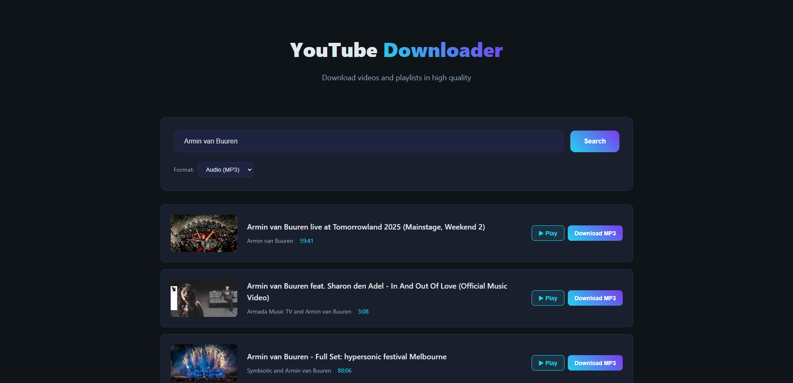
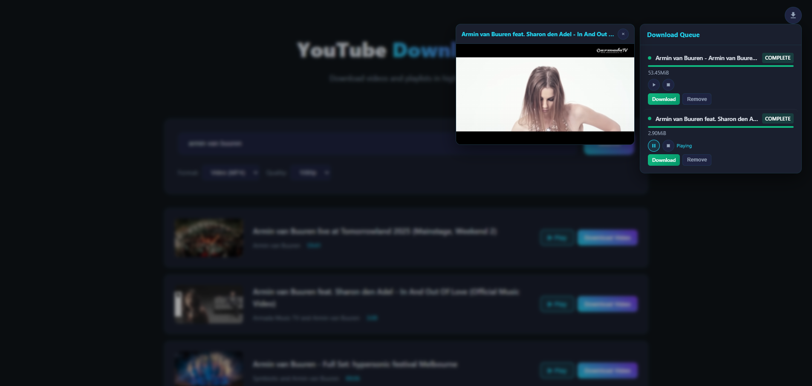
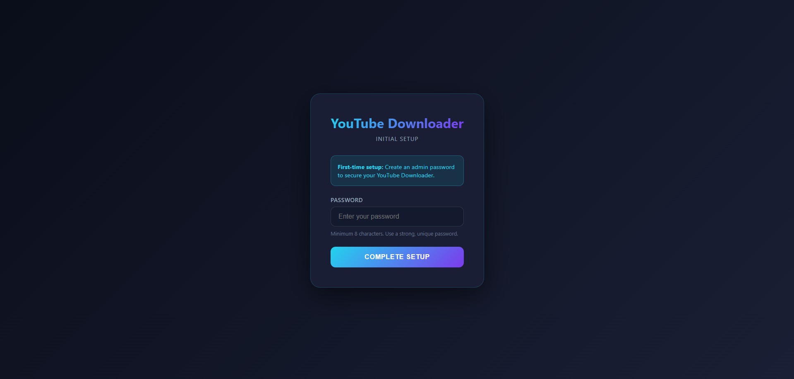
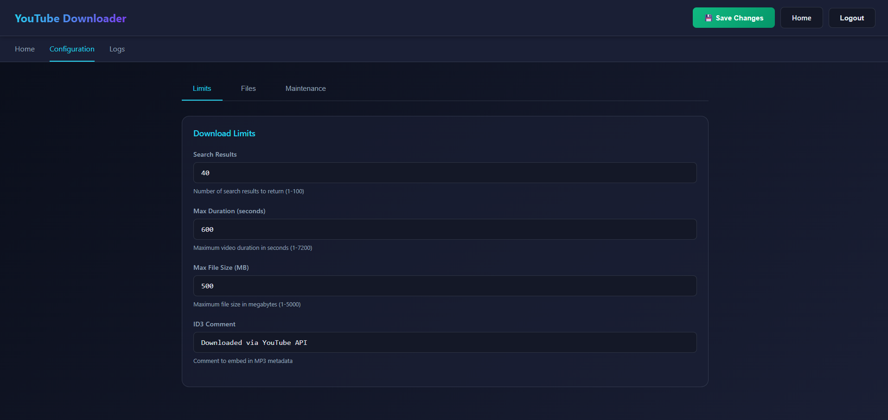
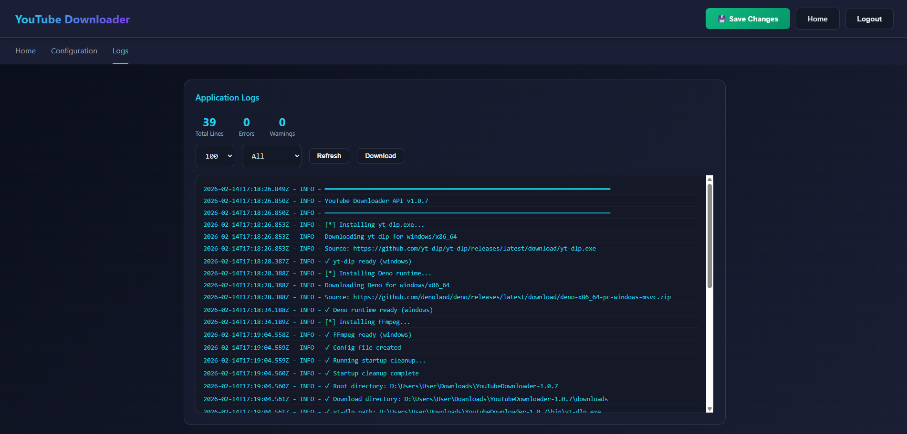

# 🦕 YouTube Downloader - Deno Edition

> A modern, fast, and self-contained YouTube downloader with automatic dependency management

[](https://deno.land/)
[](LICENSE)
[]()

**One-click deployment** • **Single binary** • **Auto-downloads dependencies** • **Modern UI**







---

  ## ✨ Features

  - 🎵 Download YouTube content as MP3 (audio) or MP4 (video)
  - 📂 Download entire playlists with per-track progress and ZIP export
  - 📋 Live download queue panel with status, progress, speed, ETA, and actions
  - ♻️ Persistent queue recovery across restarts (filesystem-backed job state)
  - ⏯️ Interrupted download recovery with manual resume support (--continue)
  - ▶️ Built-in playback from queue (audio + video panel for video files)
  - 🔍 Search YouTube directly from the interface
  - 🔐 Auth + CSRF protection with optional API endpoint protection
  - 🌐 Domain allowlist + rate limiting for safer download/search endpoints
  - 🚀 Single binary deployment with self-contained runtime behavior
  - 🤖 Auto-downloads dependencies (yt-dlp, ffmpeg)
  - 🧹 Smart cleanup system (startup, periodic, and post-download cleanup)
  - 🎯 Robust edge-case handling (geo-blocked items, playlist detection, disconnect-safe streaming)
  - 💻 Cross-platform (Windows, Linux, macOS)
  - 🐳 Docker support (optional)

---

## 🚀 Quick Start

### Windows (Easiest)

```cmd
# 1. Download latest release or clone repo
git clone https://github.com/wggriffiths/YouTube-Media-Downloader
cd youtube-downloader-deno

# 2. Compile binary
deno compile --allow-all --output ytdl.exe api.ts

# 3. Run startup script
start-clean.bat

# 4. Open browser
http://localhost:8000
```

**That's it!** yt-dlp and ffmpeg download automatically on first run.

---

### Linux/macOS

```bash
# 1. Clone repo
git clone https://github.com/wggriffiths/YouTube-Media-Downloader
cd youtube-downloader-deno

# 2. Install dependencies (one-time)
pip install yt-dlp
# macOS: brew install ffmpeg
# Linux: apt install ffmpeg

# 3. Run
chmod +x deploy.sh
./deploy.sh
```

---

### Docker

```bash
docker-compose up -d
```

Visit `http://localhost:8000`

---

## 📸 Screenshots

*(Add screenshot here)*

### Features Demo

- **Search & Download**: Paste URL or search YouTube
- **Format Selection**: Choose MP3 (audio) or MP4 (video)
- **Quality Options**: Select video quality (1080p, 720p, 480p, 360p)
- **Playlist Support**: Download entire playlists as ZIP
- **Progress Tracking**: Real-time download progress

---

## 🎯 Why This Project?

Most YouTube downloaders require complex setup:
- ❌ Manual ffmpeg installation
- ❌ Manual yt-dlp installation  
- ❌ Environment variable configuration
- ❌ Multiple dependencies
- ❌ Outdated interfaces

**This project:**
- ✅ **One-click setup** (auto-downloads everything)
- ✅ **Single binary** (no runtime needed)
- ✅ **Modern UI** (dark theme, responsive)
- ✅ **Production-ready** (proper cleanup, error handling)
- ✅ **Type-safe** (TypeScript)
- ✅ **Fast** (Deno runtime)

---

## 📦 What Makes This Special?

### 1. Auto-Dependency Management (Windows)

```
First run:
[*] Downloading yt-dlp.exe...  ✓
[*] Downloading ffmpeg.exe...  ✓
[*] Extracting ffmpeg...       ✓
[+] All dependencies ready!
```

**No manual setup required.**

---

### 2. Single Binary Deployment

```
Traditional Python app:
├── python.exe (50MB)
├── pip dependencies (100MB+)
├── yt-dlp library
├── ffmpeg (separate install)
└── Complex virtual env setup

This app:
└── ytdl.exe (55MB) ← DONE
```

---

### 3. Smart Cleanup System

**Three-phase cleanup:**
- **Startup**: Removes all orphaned folders (fresh start)
- **Periodic**: Cleans jobs older than 1 hour (every 5 min)
- **Post-download**: Removes files 10 min after user downloads

**No disk space accumulation!**

---

### 4. Edge Case Handling

**Playlist Detection:**
```
✓ youtube.com/playlist?list=PLxxx          → Playlist
✓ youtube.com/watch?v=ID&list=PLxxx        → Single video
✓ youtu.be/ID?list=PLxxx                   → Single video
```

**Geo-Blocked Videos:**
```
Playlist with unavailable videos:
✓ Skips blocked videos
✓ Downloads available ones
✓ Creates ZIP with accessible content
✗ Doesn't fail entire download
```

---

## 🏗️ Architecture

```
┌─────────────────────────────────────┐
│         Deno API (api.ts)           │
│                                     │
│  ┌──────────────┐  ┌─────────────┐  │
│  │   Frontend   │  │  API Routes │  │
│  │   (index.html)  │  /search    │  │
│  │              │  │  /download  │  │
│  │              │  │  /status    │  │
│  └──────────────┘  └─────────────┘  │
│                                     │
│         Calls yt-dlp CLI            │
└─────────────────────────────────────┘
```

**Single service** handles:
- Frontend serving (HTML/CSS/JS)
- API endpoints
- Job queue management
- Background downloads
- Cleanup tasks

---

## 🛠️ Tech Stack

- **Runtime**: [Deno](https://deno.land/) 1.40+
- **Framework**: [Oak](https://deno.land/x/oak) (HTTP server)
- **Downloader**: [yt-dlp](https://github.com/yt-dlp/yt-dlp)
- **Converter**: [ffmpeg](https://ffmpeg.org/)
- **Language**: TypeScript
- **Frontend**: Vanilla JS (no framework bloat)

---

## 🚢 Deployment Options

### 1. Compiled Binary (Recommended)
```bash
deno compile --allow-all --output ytdl api.ts
./ytdl
```

**Pros:**
- ✅ Single executable
- ✅ No Deno runtime needed
- ✅ Fast startup
- ✅ Easy distribution

---

### 2. Docker
```bash
docker-compose up -d
```

**Pros:**
- ✅ Isolated environment
- ✅ All dependencies included
- ✅ Easy updates
- ✅ Cross-platform

---

### 3. Systemd Service (Linux)
```bash
sudo cp ytdl /usr/local/bin/
sudo systemctl enable ytdl.service
```

See [docs/DEPLOYMENT.md](docs/DENO_DEPLOYMENT_GUIDE.md) for details.

---

## 📖 Documentation

- [Windows Deployment Guide](docs/WINDOWS_DEPLOYMENT.md)
- [Deno Deployment Guide](docs/DENO_DEPLOYMENT_GUIDE.md)
- [Migration from Python](docs/MIGRATION_CHECKLIST.md)
- [Code Comparison](docs/CODE_COMPARISON.md)

---

## 🔧 Configuration

Environment variables (optional):

| Variable | Default | Description |
|----------|---------|-------------|
| `PORT` | 8000 | HTTP server port |
| `DOWNLOAD_DIR` | ./downloads | Download directory |
| `SEARCH_RESULTS` | 40 | Max search results |
| `YT_DLP_PATH` | yt-dlp | Path to yt-dlp binary |

---

## 🤝 Contributing

Contributions welcome! Please:

1. Fork the repo
2. Create a feature branch (`git checkout -b feature/amazing`)
3. Commit changes (`git commit -m 'Add amazing feature'`)
4. Push to branch (`git push origin feature/amazing`)
5. Open a Pull Request

---

## 📝 API Endpoints

```
GET  /                     → Serve frontend
GET  /health               → Health check
POST /search               → Search YouTube
POST /download             → Start download
GET  /status/:id           → Check status
GET  /status/playlist/:id  → Check playlist status
GET  /download/:id         → Download file
GET  /download/playlist/:id → Download ZIP
```

---

## 🐛 Troubleshooting

**yt-dlp not found:**
```bash
# Windows
set YT_DLP_PATH=C:\path\to\yt-dlp.exe

# Linux/Mac
export YT_DLP_PATH=/path/to/yt-dlp
```

**Port already in use:**
```bash
export PORT=9000
./ytdl
```

See [Troubleshooting Guide](docs/WINDOWS_DEPLOYMENT.md#troubleshooting) for more.

---

## 📄 License

MIT License - see [LICENSE](LICENSE) file for details.

---

## 🙏 Acknowledgments

- [Deno](https://deno.land/) - Modern TypeScript runtime
- [yt-dlp](https://github.com/yt-dlp/yt-dlp) - YouTube downloader
- [ffmpeg](https://ffmpeg.org/) - Media converter
- [Oak](https://deno.land/x/oak) - HTTP framework

---

## ⭐ Star History

If you find this project useful, please consider giving it a star! ⭐

---

## 📬 Support

- 🐛 **Bug reports**: [Open an issue](https://github.com/yourusername/youtube-downloader-deno/issues)
- 💡 **Feature requests**: [Open an issue](https://github.com/yourusername/youtube-downloader-deno/issues)
- 💬 **Questions**: [Discussions](https://github.com/yourusername/youtube-downloader-deno/discussions)

---

## 🎯 Roadmap

- [ ] WebSocket progress updates (eliminate polling)
- [ ] Batch download queue
- [ ] Custom output templates
- [ ] Subtitle download support
- [ ] Mobile-responsive UI improvements
- [ ] Download history persistence
- [ ] Rate limiting options

---

**Made with ❤️ using Deno and TypeScript**

**[⬆ Back to top](#-youtube-downloader---deno-edition)**
